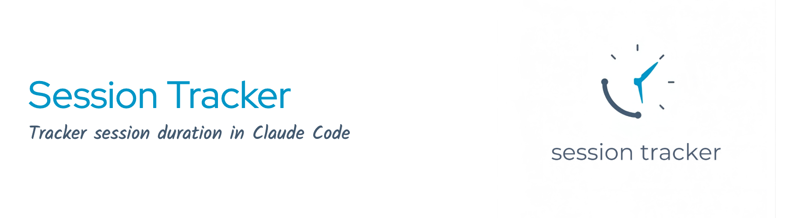

<p align="center">
  
</p>

# session-tracker

Track Claude Code session duration with automatic timestamps.

## Features

- **SessionStart hook** - saves a start timestamp under `~/.claude/session-env/<session_id>/` and reports its path as `CLAUDE_SESSION_FILE` in hook output
- **SessionEnd hook** - appends completed sessions to a JSONL history log for worklog reports
- **Active (working) time** - active time is computed additively from `events.log`: each prompt→stop bracket counts in full, plus up to `SESSION_IDLE_THRESHOLD_SECONDS` (default 120s) of reading after each turn. A session left open while you work elsewhere stops accruing, so concurrent sessions on the same project stay honest. `PreToolUse`/`PostToolUse` heartbeats record tool activity for a forensic timeline.
- **Persistent session files** - session data survives session end so you can track hours later
- **`/session-tracker:session-status` skill** - check elapsed time, plus today's accumulated total
- **`/session-tracker:session-history` command + skill** - review past sessions filtered by date or project
- **`/session-tracker:reset-session` command** - reset the timer to zero
- **Auto-reset on `/clear`** - clearing the session automatically restarts the timer
- **Status line snippet** - optional integration for live timer display

## Installation

### Option 1: From Marketplace (recommended)

```bash
# Add as a standalone marketplace plugin
claude plugin marketplace add aguinaldotupy/claude-session-tracker

# Install the plugin
claude plugin install session-tracker@aguinaldotupy --scope user

# Restart Claude Code to activate hooks
```

### Option 2: Local Install (development)

```bash
git clone https://github.com/aguinaldotupy/claude-session-tracker.git
claude --plugin-dir ./claude-session-tracker
```

### Option 3: Manual Install

```bash
# Clone into the plugins directory
git clone https://github.com/aguinaldotupy/claude-session-tracker.git \
  ~/.claude/plugins/marketplaces/claude-session-tracker
```

Then enable in `~/.claude/settings.json`:

```json
{
  "enabledPlugins": {
    "session-tracker@claude-session-tracker": true
  }
}
```

### Verify Installation

Inside a Claude Code session:

```
/plugin
```

Navigate to the **Installed** tab - `session-tracker` should appear.

## Usage

### Check Session Time

Type `/session-tracker:session-status` or ask naturally:

- "how long is this session?"
- "quanto tempo de sessao?"
- "session duration"

Example output:

```
Trabalho: 48m · sessão aberta há 1h 23m (idle 35m, desde 14:30)
```

Active time credits each prompt→stop bracket fully, plus up to `SESSION_IDLE_THRESHOLD_SECONDS` seconds of reading after each turn (default 120). Tune it, e.g. `export SESSION_IDLE_THRESHOLD_SECONDS=60` for a stricter 1-minute reading grace. Wall-clock (shown as "aberta há…", i.e. "open for") is reported only as context.

### Reset Timer

Type `/session-tracker:reset-session` or ask naturally:

- "reset the session timer"
- "reiniciar o tempo"
- "restart timer"

The timer resets to zero from the current time. The `/clear` command also resets the timer automatically.

### Session History & Worklog

Each time a session ends, the `SessionEnd` hook records the session (id, start/end timestamps, duration, project, branch/issue, and exit reason) in the local SQLite database at `~/.claude/session-env/history.db`. If `sqlite3` isn't installed, it falls back to appending a JSON line to `~/.claude/session-env/history.jsonl` instead.

**Migration:** on the first session after upgrading, any existing `history.jsonl` is imported into SQLite automatically and renamed `history.jsonl.imported`. No action needed.

Query it with `/session-tracker:session-history` or ask naturally:

- "quanto trabalhei hoje?"
- "worklog da semana"
- "session history last 7 days"
- "histórico de sessões nesse projeto"

The command accepts an optional date filter (`today`, `yesterday`, `7d`, `30d`, or `YYYY-MM-DD..YYYY-MM-DD`) and an optional `--project <substring>` filter. It prints a markdown table of sessions plus a total. See `commands/session-history.md` and `skills/session-history/SKILL.md` for details.

`/session-tracker:session-status` also reports today's accumulated total (previous completed sessions plus the current live elapsed).

### Issue Tagging & Worklog

Each finished session is tagged with an issue key (e.g. `LIN-456`, `ABC-123`) so the worklog can group time per ticket.

Resolution order used by the `SessionEnd` hook:

1. Explicit tag written via `/session-tracker:tag LIN-456` — stored at `~/.claude/session-env/<session_id>/issue-tag`.
2. Branch heuristic — the first `[A-Z][A-Z0-9_]+-[0-9]+` match on the current git branch (works with common conventions like `feat/LIN-456-title`).
3. Empty if nothing resolves. Older entries without `issue_key` are treated as empty.

Tag the current session mid-flight:

```
/session-tracker:tag LIN-456
/session-tracker:tag --clear
```

Forgot to tag? Retroactively fix any session that already ended without an issue key:

```
/session-tracker:tag-session abc12345 LIN-456     # tag an old session by id prefix
/session-tracker:tag-session abc12345 --clear     # blank the tag again
```

The worklog flow itself also offers inline retroactive tagging — when it spots an "Untagged" bucket, it walks you through each session and lets you tag, batch-tag, or skip before anything is posted to your MCP.

Then post your worklog to whichever issue tracker MCP you have connected:

```
/session-tracker:worklog            # today (default)
/session-tracker:worklog 7d
/session-tracker:worklog 2026-04-01..2026-04-14
```

`/session-tracker:worklog` is **MCP-agnostic** — it introspects the tool inventory at runtime and adapts to whatever is connected. It supports true Jira worklog semantics (`timeSpent`), Linear comments (since Linear has no native worklog), and Notion time-tracking databases, and falls back to a clean copy-pasteable markdown block when no tracker MCP is available. Every post is previewed and confirmed before any tool call; posts are logged to `~/.claude/session-env/worklog-posted.log` for dedup.

See `commands/tag.md` and `commands/worklog.md` for full details.

## Status Line (optional)

To show elapsed time in the status line, copy the contents of `statusline-snippet.sh` into your `~/.claude/statusline-command.sh`.

Example output:

```
tupy@host:project (main*) [Opus 4.6] 45m
```

The time shown is **active** (working) time — the same number `session-status` headlines, not wall-clock.

## How It Works

1. On session start, the `SessionStart` hook reads `session_id` from its stdin JSON and writes the start timestamp to `~/.claude/session-env/<session_id>/session-tracker`, then prints that path back as `CLAUDE_SESSION_FILE` in its hook output (no `CLAUDE_ENV_FILE` indirection)
2. The session ID is stable across context compaction, so the timestamp survives compact and resume without extra hooks
3. `/session-tracker:session-status` and the statusline locate the file by `session_id` under `~/.claude/session-env/<session_id>/` and read it from that per-session directory
4. Session files persist after session end - no data is lost when closing Claude Code
5. Using `/clear` or starting a new session creates a fresh timestamp
6. `UserPromptSubmit`/`Stop` and `PreToolUse`/`PostToolUse` hooks append `P`/`S` and `T`/`D <tool>` lines to `events.log`; active time is computed additively (prompt→stop brackets plus a bounded reading grace) by `hooks/lib/active-time.awk`, which `SessionStart` deploys to `~/.claude/session-env/active-time.awk` for the statusline and skills to share

## Managing the Plugin

```bash
# Disable without uninstalling
claude plugin disable session-tracker@aguinaldotupy --scope user

# Re-enable
claude plugin enable session-tracker@aguinaldotupy --scope user

# Uninstall
claude plugin uninstall session-tracker@aguinaldotupy --scope user

# Update to latest version
claude plugin update session-tracker@aguinaldotupy --scope user
```

## Requirements

- Claude Code >= 2.1.x
- bash, date, cat, jq (standard on macOS and Linux; install jq if missing)
- **`sqlite3`** (soft dependency) — the session history is stored in a local
  SQLite database at `~/.claude/session-env/history.db`. If `sqlite3` is not
  installed the plugin still works, falling back to a JSON-lines log; install
  `sqlite3` to get the relational store, correct cross-session totals, and
  per-project (worktree-aware) grouping. Present by default on macOS.

## License

MIT
